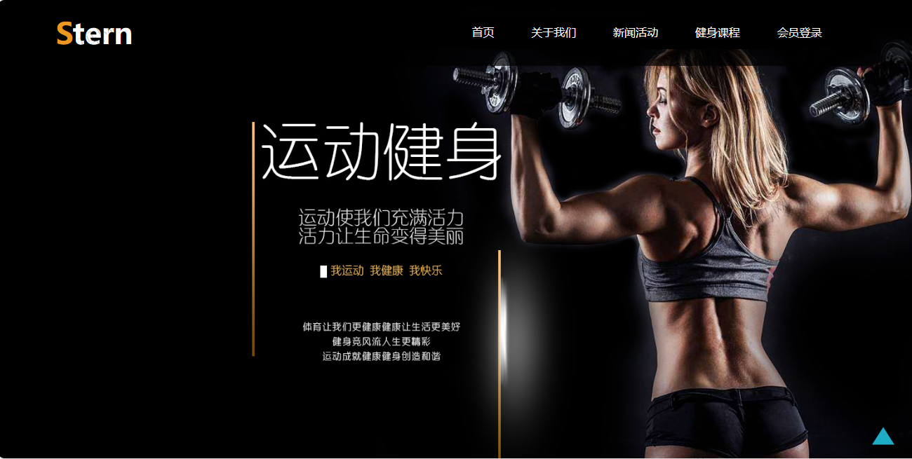
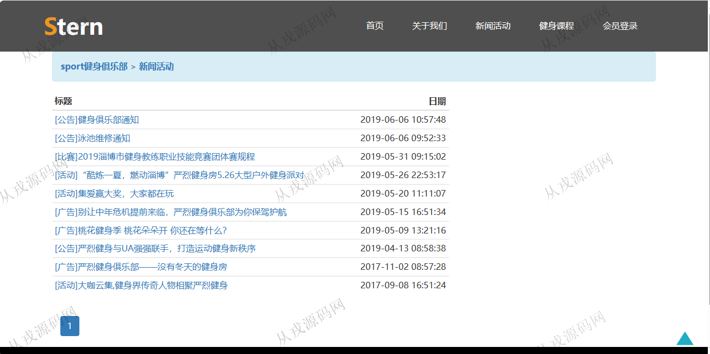
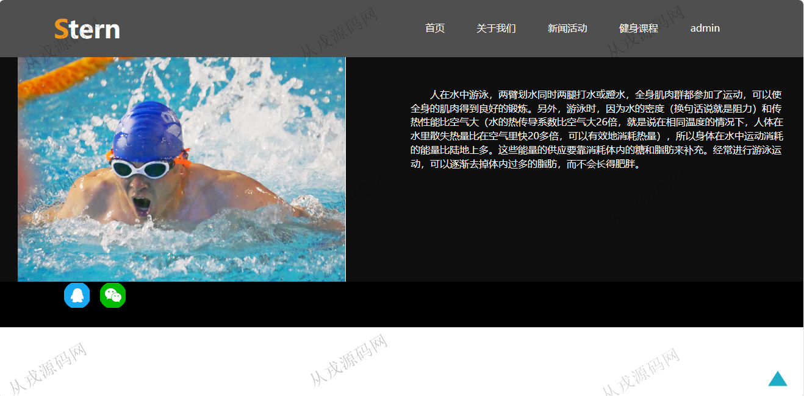
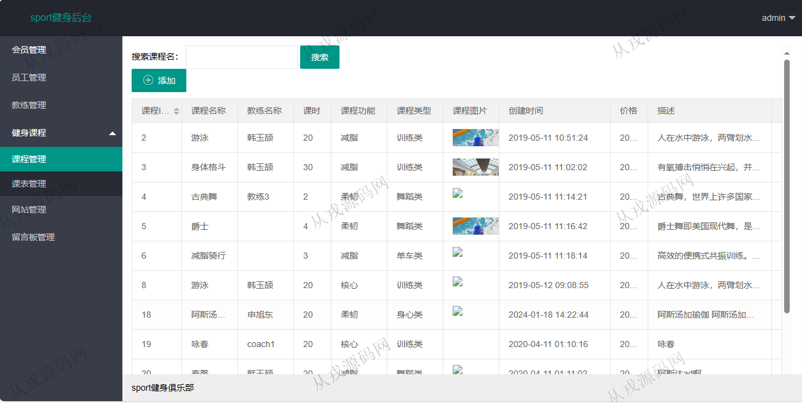
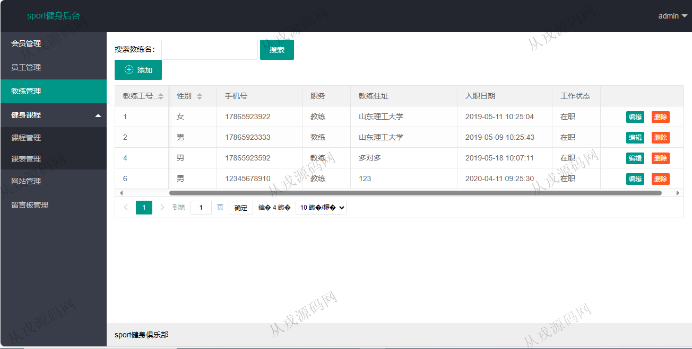
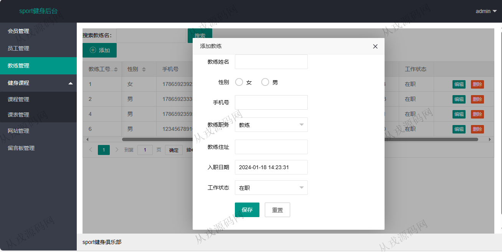
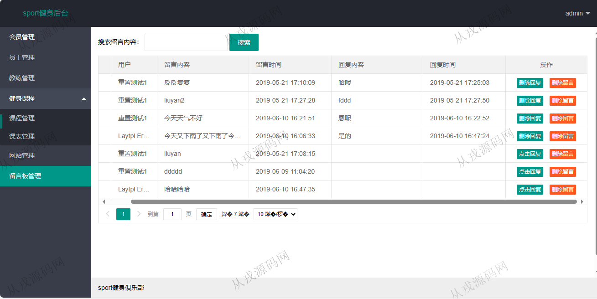
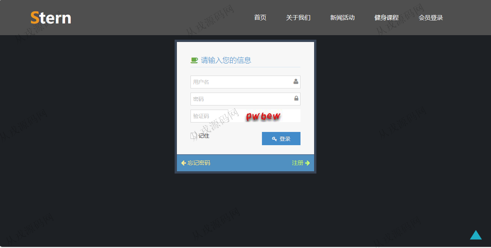

<h1 align="center">173.运动健身管理系统</h1>

 获取sql文件 QQ: 386869957 QQ群: 377586148 

 [更多源码项目: 从戎源码网](https://armycodes.com/) 

## 简介

> 本代码来源于网络,仅供学习参考使用!
>
> 提供1.远程部署/2.修改代码/3.设计文档指导/4.框架代码讲解等服务
> 
> 访问地址：http://localhost:8080/SternGym/
> 
> 管理员：admin admin
> 
> 用户：user 123456
>

## 项目介绍
基于ssm的运动健身管理系统：前端 jsp、jquery、bootstrap，后端 maven、springmvc、spring、mybatis；角色分为管理员、用户；集成新闻活动、健身课程、教练管理等功能于一体的系统。

## 功能介绍

### 用户

- 基本功能：登录，注册，退出
- 网站首页：主导航栏，广告大图，健身资讯，健身教练，联系我们
- 新闻活动：新闻活动列表展示，活动详情
- 健身课程：课程列表展示，课程查找，课程表查看，课程详情

### 管理员

- 会员管理：会员信息的列表查询，编辑和删除，按会员名搜索，会员信息由用户自行注册
- 员工管理：员工信息的增删改查，按员工名搜索记录
- 教练管理：教练信息的增删改查，按教练名搜索记录
- 课程管理：课程信息的增删改查，课程图片上传，按课程名搜索课程
- 课表管理：课表文件上传
- 网站管理：新闻信息的增删改查，新闻内容支持富文本编辑
- 留言板管理：留言板信息的列表查询，删除留言，点击回复，删除回复

## 环境

- <b>IntelliJ IDEA 2021.3</b>

- <b>Mysql 5.7.26</b>

- <b>Tomcat 9.0.37</b>

- <b>JDK 1.8</b>

## 运行截图

